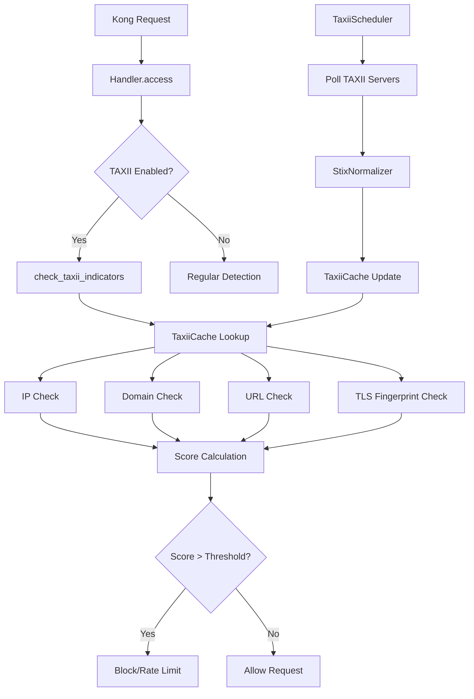

# Kong Guard AI - TAXII/STIX Technical Implementation Guide

## Architecture Deep Dive

### Module Structure

```
kong/plugins/kong-guard-ai/
├── handler.lua # Main plugin handler with TAXII integration
├── schema.lua # Configuration schema with TAXII fields
├── taxii_client.lua # TAXII 2.x HTTP client implementation
├── stix_normalizer.lua # STIX indicator parsing and normalization
├── taxii_cache.lua # Shared memory cache management
├── taxii_scheduler.lua # Background polling and state management
└── tests/
    ├── unit/ # Unit tests for each module
    └── integration/ # Integration tests with Kong Pongo
```

### Component Interactions



## Implementation Details

### 1. TAXII Client (`taxii_client.lua`)

#### Key Features
- **Protocol Support**: Full TAXII 2.0 and 2.1 compatibility
- **Authentication**: Basic, Bearer, and no-auth support
- **Resilience**: Exponential backoff with configurable retries
- **Validation**: Server configuration and response validation

#### Core Methods

```lua
-- Create client instance
local client = TaxiiClient.new(config)

-- Discover server capabilities
local discovery, err = client:discover_server(server_config)

-- Get collections
local collections, err = client:get_collections(server_config, api_root_url)

-- Poll for objects with pagination
local result, err = client:poll_collection(server_config, api_root_url, collection_id, {
    added_after = "2023-01-01T00:00:00Z",
    limit = 100,
    next = "pagination_cursor"
})
```

#### Error Handling Strategy

```lua
-- Retry logic with exponential backoff
local function http_request_with_retry(method, url, headers, body)
    local retry_delay = self.retry_config.initial
    local max_retries = 3

    for attempt = 1, max_retries do
        local res, err = httpc:request_uri(url, {
            method = method,
            headers = headers,
            body = body,
            ssl_verify = not self.insecure
        })

        if res and res.status >= 200 and res.status < 300 then
            return res, nil
        elseif res and (res.status >= 500 or res.status == 429) then
            -- Retry on server errors and rate limiting
            if attempt < max_retries then
                ngx.sleep(retry_delay / 1000)
                retry_delay = math.min(retry_delay * self.retry_config.factor, self.retry_config.max)
            end
        else
            -- Don't retry on client errors
            return nil, "HTTP " .. (res and res.status or "error") .. ": " .. (res and res.body or err)
        end
    end

    return nil, "Max retries exceeded"
end
```

### 2. STIX Normalizer (`stix_normalizer.lua`)

#### Indicator Extraction Pipeline

```lua
function StixNormalizer:parse_indicator(stix_object)
    -- 1. Validate STIX object structure
    if not stix_object or stix_object.type ~= "indicator" then
        return nil
    end

    -- 2. Extract pattern field
    local pattern = stix_object.pattern
    if not pattern then
        return nil
    end

    -- 3. Parse different indicator types
    local result = {
        id = stix_object.id,
        labels = stix_object.labels,
        valid_from = stix_object.valid_from,
        valid_until = stix_object.valid_until,
        confidence = stix_object.confidence,
        indicators = {
            ips = {},
            domains = {},
            urls = {},
            hashes = {},
            regexes = {},
            tls_fingerprints = {}
        }
    }

    -- 4. Extract and normalize each indicator type
    self:extract_ip_indicators(pattern, result.indicators.ips)
    self:extract_domain_indicators(pattern, result.indicators.domains)
    self:extract_url_indicators(pattern, result.indicators.urls)
    self:extract_hash_indicators(pattern, result.indicators.hashes)
    self:extract_tls_fingerprints(pattern, result.indicators.tls_fingerprints)

    return result
end
```

#### Normalization Functions

```lua
-- IP address normalization with validation
function StixNormalizer:_normalize_ipv4(ip)
    local parts = {}
    for part in ip:gmatch("(%d+)") do
        local num = tonumber(part)
        if not num or num < 0 or num > 255 then
            return nil
        end
        table.insert(parts, num)
    end

    if #parts ~= 4 then
        return nil
    end

    return table.concat(parts, ".")
end

-- Domain normalization with IDNA considerations
function StixNormalizer:_normalize_domain(domain)
    -- Remove leading/trailing whitespace and convert to lowercase
    domain = domain:match("^%s*(.-)%s*$"):lower()

    -- Remove leading dot if present
    domain = domain:gsub("^%.", "")

    -- Basic validation
    if not domain:match("^[%w%.%-]+$") then
        return nil
    end

    -- Check for invalid patterns
    if domain:match("%.%.") or domain:match("^%-") or domain:match("%-$") then
        return nil
    end

    return domain
end
```

#### Safe Regex Handling

```lua
function StixNormalizer:_validate_regex(pattern)
    -- Remove STIX pattern wrapper
    pattern = pattern:gsub("^%[.*:value%s*=%s*['\"]", ""):gsub("['\"]%s*%]$", "")

    -- Count metacharacters to detect complexity
    local meta_count = 0
    local dangerous_patterns = {"%(", "%)", "%[", "%]", "%^", "%$", "%.", "%*", "%+", "%?", "\\", "|"}

    for _, meta in ipairs(dangerous_patterns) do
        local _, count = pattern:gsub(meta, "")
        meta_count = meta_count + count
    end

    -- Reject overly complex patterns
    if meta_count > 10 then
        return nil
    end

    -- Test compilation safety
    local success, result = pcall(function()
        return string.match("test", pattern)
    end)

    if not success then
        return nil
    end

    return pattern
end
```

### 3. TAXII Cache (`taxii_cache.lua`)

#### Versioned Cache Architecture

```lua
-- Cache key structure
local function make_indicator_key(version, ioc_type, value)
    return string.format("taxii:%s:%s:%s", version, ioc_type, value)
end

-- Atomic version swap for zero-downtime updates
function TaxiiCache:atomic_swap_version(new_version)
    local current_version = self:get_current_version()

    -- Perform atomic swap
    local success, err = self.cache_dict:set("taxii:version", new_version)
    if not success then
        return false, err
    end

    -- Schedule cleanup of old version
    ngx.timer.at(30, function() -- 30 second grace period
        self:cleanup_version(current_version)
    end)

    return true, nil
end
```

#### Efficient Lookup Operations

```lua
-- IP lookup with CIDR support
function TaxiiCache:lookup_ip(ip)
    local version = self:get_current_version()

    -- Direct IP lookup first
    local key = make_indicator_key(version, "ip", ip)
    local result = self:get_indicator(key)
    if result then
        return result
    end

    -- Check CIDR ranges
    return self:lookup_ip_in_cidrs(ip, version)
end

-- Optimized CIDR matching
function TaxiiCache:lookup_ip_in_cidrs(ip, version)
    local cidr_keys = self.cache_dict:get_keys(100)
    local cidr_pattern = "taxii:" .. version .. ":cidr:"

    for _, key in ipairs(cidr_keys or {}) do
        if key:find(cidr_pattern, 1, true) == 1 then
            local cidr = key:sub(#cidr_pattern + 1)
            if self:ip_in_cidr(ip, cidr) then
                return self:get_indicator(key)
            end
        end
    end

    return nil
end
```

#### Memory Management

```lua
-- Bulk loading with error handling
function TaxiiCache:bulk_load_indicators(version, indicator_sets)
    local total_loaded = 0
    local errors = 0

    -- Process each indicator type
    for set_type, indicators in pairs(indicator_sets) do
        for value, metadata in pairs(indicators) do
            local ioc_type = self:map_set_type_to_cache_type(set_type)
            if self:store_indicator(version, ioc_type, value, metadata) then
                total_loaded = total_loaded + 1
            else
                errors = errors + 1
            end
        end
    end

    return {
        loaded = total_loaded,
        errors = errors
    }
end

-- Cleanup with memory efficiency
function TaxiiCache:cleanup_version(version)
    local keys_cleaned = 0
    local pattern = "taxii:" .. version .. ":"

    -- Batch key cleanup to avoid memory spikes
    local batch_size = 100
    local keys = self.cache_dict:get_keys(batch_size)

    while keys and #keys > 0 do
        for _, key in ipairs(keys) do
            if key:find(pattern, 1, true) == 1 then
                self.cache_dict:delete(key)
                keys_cleaned = keys_cleaned + 1
            end
        end
        keys = self.cache_dict:get_keys(batch_size)
    end

    return keys_cleaned
end
```

### 4. TAXII Scheduler (`taxii_scheduler.lua`)

#### Polling State Machine

```lua
function TaxiiScheduler:poll_all_servers()
    if not self.running then
        return
    end

    local servers = self.config.taxii_servers or {}
    local total_indicators = 0
    local total_errors = 0

    -- Process each configured server
    for _, server_config in ipairs(servers) do
        local indicators, errors = self:poll_server_with_backoff(server_config)
        total_indicators = total_indicators + indicators
        total_errors = total_errors + errors
    end

    -- Update metrics
    self:update_polling_metrics(total_indicators, total_errors)

    -- Schedule next poll if still running
    if self.running then
        local next_interval = self:calculate_next_interval(total_errors)
        ngx.timer.at(next_interval, function()
            self:poll_all_servers()
        end)
    end
end
```

#### Error Handling and Backoff

```lua
function TaxiiScheduler:poll_server_with_backoff(server_config)
    local server_url = server_config.url
    local failure_count = self:get_server_failure_count(server_url)

    -- Apply backoff for repeated failures
    if failure_count > 0 then
        local backoff_delay = self:calculate_backoff_delay(failure_count)
        local last_attempt = self:get_last_attempt_time(server_url)

        if ngx.time() - last_attempt < backoff_delay then
            return 0, 0 -- Skip this attempt
        end
    end

    local indicators, errors = self:poll_server(server_config)

    if errors > 0 then
        self:increment_server_failure_count(server_url)
    else
        self:reset_server_failure_count(server_url)
    end

    self:set_last_attempt_time(server_url, ngx.time())

    return indicators, errors
end
```

#### Pagination Handling

```lua
function TaxiiScheduler:poll_collection(server_config, api_root_url, collection)
    local collection_id = collection.id
    local state = self.cache:get_collection_state(server_config.url, collection_id)

    local poll_options = {
        limit = self.max_objects
    }

    -- Resume from cursor or timestamp
    if state.cursor then
        poll_options.next = state.cursor
    elseif state.last_poll then
        poll_options.added_after = state.last_poll
    end

    local total_indicators = 0
    local has_more = true

    -- Process all pages
    while has_more and self.running do
        local result, err = self.client:poll_collection(
            server_config, api_root_url, collection_id, poll_options
        )

        if not result then
            return 0, 1 -- Error occurred
        end

        -- Process this batch
        if #result.objects > 0 then
            local processed = self:process_stix_objects(
                result.objects, server_config.url, collection_id
            )
            total_indicators = total_indicators + processed
        end

        -- Update pagination state
        has_more = result.more or false
        if result.next then
            poll_options.next = result.next
            poll_options.added_after = nil
        else
            has_more = false
        end
    end

    -- Update collection state
    self:update_collection_state(server_config.url, collection_id, poll_options)

    return total_indicators, 0
end
```

### 5. Handler Integration (`handler.lua`)

#### TAXII Threat Detection Flow

```lua
function KongGuardAIHandler:check_taxii_indicators(features, config)
    local taxii_cache = TaxiiCache.new(config)
    if not taxii_cache then
        return 0, "none", {}
    end

    local threat_score = 0
    local threat_type = "none"
    local taxii_details = {
        matches = {},
        checked_indicators = {},
        sources = {}
    }

    local weights = config.taxii_score_weights or {}

    -- Extract request features
    local client_ip = features.client_ip
    local host = features.host or kong.request.get_header("Host")
    local path = features.path or kong.request.get_path()

    -- Check IP indicators
    if client_ip then
        local ip_match = taxii_cache:lookup_ip(client_ip)
        if ip_match then
            local score_impact = self:calculate_indicator_score(ip_match, weights, "ip")
            threat_score = math.max(threat_score, score_impact.score)

            if score_impact.score > 0 then
                threat_type = score_impact.threat_type
                table.insert(taxii_details.matches, score_impact.details)
                taxii_details.sources[ip_match.metadata.source_id] = true
            end
        end
    end

    -- Check domain indicators
    if host then
        local domain_match = taxii_cache:lookup_domain(host)
        if domain_match then
            local score_impact = self:calculate_indicator_score(domain_match, weights, "domain")
            threat_score = math.max(threat_score, score_impact.score)

            if score_impact.score > 0 then
                threat_type = score_impact.threat_type
                table.insert(taxii_details.matches, score_impact.details)
                taxii_details.sources[domain_match.metadata.source_id] = true
            end
        end
    end

    -- Check URL indicators
    if host and path then
        local full_url = "http://" .. host .. path
        local url_match = taxii_cache:lookup_url(full_url)
        if url_match then
            local score_impact = self:calculate_indicator_score(url_match, weights, "url")
            threat_score = math.max(threat_score, score_impact.score)

            if score_impact.score > 0 then
                threat_type = score_impact.threat_type
                table.insert(taxii_details.matches, score_impact.details)
                taxii_details.sources[url_match.metadata.source_id] = true
            end
        end
    end

    -- Check TLS fingerprints if enabled
    if config.enable_tls_fingerprints then
        self:check_tls_fingerprints(taxii_cache, config, weights, taxii_details)
    end

    return threat_score, threat_type, taxii_details
end
```

#### Score Calculation Logic

```lua
function KongGuardAIHandler:calculate_indicator_score(match, weights, indicator_type)
    local is_blocklist = self:is_blocklist_label(match.metadata.labels or {})
    local weight_key = indicator_type .. (is_blocklist and "_blocklist" or "_allowlist")
    local weight = weights[weight_key] or 0

    -- Apply confidence modifier
    local confidence = match.metadata.confidence or 100
    local confidence_modifier = confidence / 100
    local final_score = weight * confidence_modifier

    return {
        score = final_score,
        threat_type = is_blocklist and ("taxii_" .. indicator_type .. "_blocklist") or "none",
        details = {
            type = indicator_type,
            value = match.value,
            action = is_blocklist and "block" or "allow",
            weight = weight,
            confidence = confidence,
            final_score = final_score,
            source_id = match.metadata.source_id,
            labels = match.metadata.labels
        }
    }
end
```

## Testing Strategy

### Unit Testing Structure

```lua
-- Example from taxii_client_spec.lua
describe("TaxiiClient", function()
    local client, mock_config

    before_each(function()
        mock_config = {
            taxii_version = "2.1",
            taxii_http_timeout_ms = 2000
        }
        client = TaxiiClient.new(mock_config)
    end)

    describe("server configuration validation", function()
        it("should validate basic server configuration", function()
            local server_config = {
                url = "https://taxii.example.com",
                auth_type = "none"
            }
            local valid, err = client:validate_server_config(server_config)
            assert.is_true(valid)
            assert.is_nil(err)
        end)

        it("should require username and password for basic auth", function()
            local server_config = {
                url = "https://taxii.example.com",
                auth_type = "basic",
                username = "user"
                -- missing password
            }
            local valid, err = client:validate_server_config(server_config)
            assert.is_false(valid)
            assert.matches("Basic auth requires username and password", err)
        end)
    end)
end)
```

### Integration Testing with Kong Pongo

```lua
-- Example from taxii_integration_spec.lua
describe("Kong Guard AI TAXII Integration", function()
    local client, admin_client

    setup(function()
        local bp = helpers.get_db_utils(nil, nil, {"kong-guard-ai"})

        -- Configure plugin with TAXII enabled
        local plugin = bp.plugins:insert({
            name = "kong-guard-ai",
            config = {
                enable_taxii_ingestion = true,
                taxii_servers = {
                    {
                        url = "http://mock-taxii:8080",
                        collections = {"test-collection"},
                        auth_type = "none"
                    }
                }
            }
        })

        assert(helpers.start_kong({
            database = "off",
            plugins = "kong-guard-ai"
        }))

        client = helpers.proxy_client()
        admin_client = helpers.admin_client()
    end)

    it("should block requests from known malicious IPs", function()
        local res = client:get("/test", {
            headers = {
                ["X-Forwarded-For"] = "1.2.3.4" -- Malicious IP from mock feed
            }
        })

        assert.res_status(403, res) -- Should be blocked
    end)
end)
```

### Mock TAXII Server for Testing

```lua
-- Simplified mock server structure
function MockTaxiiServer:get_objects_response(collection_id)
    return {
        objects = {
            {
                type = "indicator",
                id = "indicator--test-malicious-ip-1",
                pattern = "[ipv4-addr:value = '1.2.3.4']",
                labels = {"malicious-activity"},
                confidence = 85
            }
        },
        more = false
    }
end
```

## Performance Considerations

### Memory Optimization

```lua
-- Efficient indicator storage
function TaxiiCache:store_indicator_batch(indicators)
    local batch_size = 100
    local batch = {}

    for i, indicator in ipairs(indicators) do
        table.insert(batch, indicator)

        if #batch >= batch_size or i == #indicators then
            self:flush_batch(batch)
            batch = {}
        end
    end
end
```

### Request Path Optimization

```lua
-- Fast-path for allowlisted IPs
function KongGuardAIHandler:check_taxii_indicators(features, config)
    local client_ip = features.client_ip

    -- Quick allowlist check first
    local allowlist_match = taxii_cache:lookup_ip_allowlist(client_ip)
    if allowlist_match then
        return -0.5, "taxii_allowlisted", {allowlist_match = allowlist_match}
    end

    -- Continue with full threat checking
    -- ...
end
```

### Cache Efficiency

```lua
-- Memory-efficient key patterns
local function make_efficient_key(version, type, value)
    -- Use shorter key patterns to reduce memory overhead
    return string.format("t:%s:%s:%s", version, type:sub(1,1), ngx.md5(value))
end
```

## Security Implementation

### Input Validation

```lua
-- Comprehensive STIX validation
function StixNormalizer:validate_stix_object(obj)
    -- Type validation
    if type(obj) ~= "table" then
        return false, "Invalid object type"
    end

    -- Required fields
    if not obj.type or not obj.id then
        return false, "Missing required fields"
    end

    -- Pattern safety for indicators
    if obj.type == "indicator" and obj.pattern then
        if not self:validate_pattern_safety(obj.pattern) then
            return false, "Unsafe pattern detected"
        end
    end

    return true, nil
end
```

### Regex Sandboxing

```lua
function StixNormalizer:validate_pattern_safety(pattern)
    -- Whitelist approach - only allow safe patterns
    local safe_patterns = {
        "^%[ipv4%-addr:value%s*=%s*['\"][%d%.]+['\"]%]$",
        "^%[domain%-name:value%s*=%s*['\"][%w%.%-]+['\"]%]$",
        "^%[url:value%s*=%s*['\"]https?://[^'\"]+['\"]%]$"
    }

    for _, safe_pattern in ipairs(safe_patterns) do
        if pattern:match(safe_pattern) then
            return true
        end
    end

    return false
end
```

### TLS Security

```lua
-- Secure TAXII client configuration
function TaxiiClient:_create_http_client()
    local httpc = http.new()

    httpc:set_timeout(self.timeout_ms)

    -- Force TLS verification in production
    httpc:set_option("ssl_verify", not self.insecure)

    -- Set secure TLS options
    httpc:set_option("ssl_protocols", "TLSv1.2 TLSv1.3")

    return httpc
end
```

## Monitoring and Observability

### Metrics Collection

```lua
-- Comprehensive metrics tracking
function TaxiiScheduler:update_polling_metrics(indicators, errors)
    local kong_cache = ngx.shared.kong_cache

    -- Increment counters
    kong_cache:incr("taxii_polls_total", 1, 0)
    kong_cache:incr("taxii_indicators_loaded", indicators, 0)
    kong_cache:incr("taxii_errors_total", errors, 0)

    -- Update gauges
    kong_cache:set("taxii_last_poll_ts", ngx.time())
    kong_cache:set("taxii_last_poll_duration_ms", poll_duration)

    -- Health status
    local health_status = errors == 0 and "healthy" or "degraded"
    kong_cache:set("taxii_health_status", health_status)
end
```

### Structured Logging

```lua
-- Consistent log format
function log_taxii_event(level, event_type, details)
    local log_entry = {
        component = "taxii",
        event_type = event_type,
        timestamp = ngx.time(),
        details = details
    }

    kong.log[level](cjson.encode(log_entry))
end
```

### Debug Endpoints

```lua
-- Custom debug endpoints for operational visibility
function KongGuardAIHandler:handle_taxii_debug_request(path)
    if path == "/taxii/status" then
        return self:get_taxii_status()
    elseif path == "/taxii/metrics" then
        return self:get_taxii_metrics()
    elseif path == "/taxii/cache/stats" then
        return self:get_cache_statistics()
    else
        return nil, "Unknown debug endpoint"
    end
end
```

This technical guide provides the implementation details necessary for understanding, maintaining, and extending the TAXII/STIX integration in Kong Guard AI.