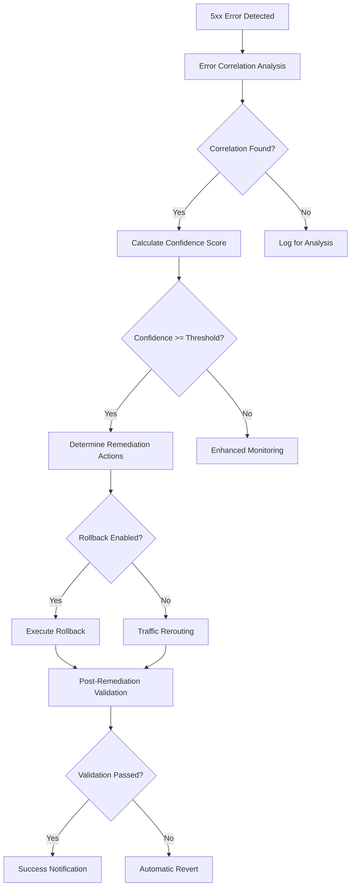

# Kong Guard AI - Advanced Remediation and Rollback System

## Overview

The Advanced Remediation System is an enterprise-grade module that provides automated incident response capabilities for Kong Gateway. It correlates 5xx errors with recent configuration changes and can automatically execute remediation actions including configuration rollbacks, traffic rerouting, and service modifications.

## Key Features

### 🔄 5xx Error Correlation
- **Real-time monitoring** of 5xx response codes
- **Temporal correlation** with configuration changes (up to 7 days)
- **Confidence scoring** based on timing and impact analysis
- **Multi-service pattern detection** for identifying system-wide issues

### 🛠️ Automated Remediation Actions
- **Configuration Rollback**: Restore previous stable configurations using decK
- **Traffic Rerouting**: Redirect traffic to healthy upstreams/services
- **Service Modification**: Disable failing services or routes
- **Circuit Breaker**: Implement circuit breaker patterns for failing services
- **Gradual Rollback**: Canary-style rollbacks with traffic shifting

### 🔒 Enterprise Safety Features
- **Dry-run validation** before executing changes
- **Multi-level confidence thresholds** for different actions
- **Rollback validation** with automatic abort on failures
- **Configuration snapshots** with versioning and retention
- **Emergency rollback** capabilities for critical scenarios

## Architecture



## Configuration

### Basic Configuration

```json
{
  "enable_advanced_remediation": false,
  "enable_5xx_correlation": true,
  "config_correlation_window": 86400,
  "error_correlation_threshold": 0.15,
  "remediation_confidence_threshold": 0.8
}
```

### Rollback Configuration

```json
{
  "enable_automatic_rollback": false,
  "rollback_confidence_threshold": 0.9,
  "enable_rollback_dry_run": true,
  "default_reroute_strategy": "immediate",
  "emergency_rollback_enabled": false,
  "emergency_error_threshold": 0.5
}
```

### Traffic Management

```json
{
  "enable_traffic_rerouting": false,
  "gradual_shift_duration": 300,
  "circuit_breaker_enabled": true,
  "circuit_breaker_failure_threshold": 10,
  "circuit_breaker_recovery_timeout": 60
}
```

### Snapshot Management

```json
{
  "enable_periodic_snapshots": true,
  "snapshot_interval_seconds": 3600,
  "max_snapshots_retained": 168,
  "backup_retention_days": 7
}
```

## Configuration Options

| Option | Type | Default | Description |
|--------|------|---------|-------------|
| `enable_advanced_remediation` | boolean | `false` | Enable advanced remediation system |
| `config_correlation_window` | number | `86400` | Time window for config correlation (seconds) |
| `error_correlation_threshold` | number | `0.15` | Error rate threshold for triggering analysis |
| `remediation_confidence_threshold` | number | `0.8` | Min confidence for automated remediation |
| `enable_automatic_rollback` | boolean | `false` | Enable automatic config rollback |
| `rollback_confidence_threshold` | number | `0.9` | Min confidence for automatic rollback |
| `enable_traffic_rerouting` | boolean | `false` | Enable automatic traffic rerouting |
| `default_reroute_strategy` | string | `"immediate"` | Strategy: immediate, gradual, canary, blue_green |
| `gradual_shift_duration` | number | `300` | Duration for gradual traffic shifting |
| `enable_rollback_dry_run` | boolean | `true` | Always perform dry run before rollback |
| `emergency_rollback_enabled` | boolean | `false` | Enable emergency rollback for critical errors |
| `emergency_error_threshold` | number | `0.5` | Error rate threshold for emergency rollback |
| `circuit_breaker_enabled` | boolean | `true` | Enable circuit breaker pattern |
| `remediation_timeout_seconds` | number | `300` | Max time for remediation operations |
| `validation_timeout_seconds` | number | `60` | Timeout for post-remediation validation |

## Safety Mechanisms

### 1. Confidence Thresholds
The system uses multiple confidence levels to ensure safe operation:

- **Correlation Confidence** (0.8 default): Minimum confidence to trigger any remediation
- **Rollback Confidence** (0.9 default): Higher threshold for destructive operations
- **Emergency Threshold** (0.5 default): Error rate for emergency procedures

### 2. Dry Run Validation
Before executing any configuration changes:
```bash
deck diff --kong-addr <admin-url> --config <rollback-config>
```

### 3. Post-Remediation Validation
After changes are applied:
- Configuration consistency checks
- Service health verification  
- Rollback abort conditions

### 4. Automatic Revert
If post-remediation validation fails:
- Automatic revert to pre-remediation state
- Incident logging and notification
- Operator alert for manual intervention

## Integration with decK

The system integrates with Kong's declarative configuration tool (decK) for:

### Configuration Snapshots
```bash
# Periodic snapshots
deck dump --kong-addr http://localhost:8001 \
          --output-file /tmp/kong-guard-ai/snapshots/SNAP-scheduled-1234567890.yaml

# Pre-remediation snapshots  
deck dump --kong-addr http://localhost:8001 \
          --output-file /tmp/kong-guard-ai/snapshots/SNAP-pre_remediation-1234567890.yaml
```

### Configuration Rollback
```bash
# Dry run validation
deck diff --kong-addr http://localhost:8001 \
          --config /tmp/kong-guard-ai/snapshots/rollback-target.yaml

# Apply rollback
deck sync --kong-addr http://localhost:8001 \
          --config /tmp/kong-guard-ai/snapshots/rollback-target.yaml
```

## Remediation Strategies

### 1. Immediate Rollback
- Instant application of previous configuration
- Highest speed, highest risk
- Used for critical error scenarios

### 2. Gradual Rollback  
- Progressive traffic shifting over time
- Configurable duration (60s - 1 hour)
- Lower risk, allows monitoring during transition

### 3. Canary Rollback
- Small percentage rollback first
- Validation before full rollback
- Safest option for production systems

### 4. Blue-Green Rollback
- Switch between two identical environments
- Requires pre-configured backup environment
- Enterprise deployment pattern

## Traffic Rerouting

### Upstream Modification
```lua
-- Reroute service to backup upstream
PATCH /services/{service_id}
{
  "url": "http://backup-upstream:8080",
  "tags": ["guard_ai_rerouted"]
}
```

### Route Modification  
```lua
-- Reroute route to backup service
PATCH /routes/{route_id}
{
  "service": {"id": "backup-service-id"},
  "tags": ["guard_ai_rerouted"]
}
```

### Weighted Load Balancing
```lua
-- Gradual traffic shifting with weights
PATCH /upstreams/{upstream_id}
{
  "targets": [
    {"target": "original-upstream:8080", "weight": 20},
    {"target": "backup-upstream:8080", "weight": 80}
  ]
}
```

## Error Correlation Algorithm

### 1. Error Pattern Analysis
```lua
local analysis = {
    total_requests = request_count,
    error_count = error_5xx_count,
    error_rate = error_count / total_requests,
    error_breakdown = {
        ["500"] = internal_errors,
        ["502"] = bad_gateway_errors,
        ["503"] = service_unavailable,
        ["504"] = timeout_errors
    }
}
```

### 2. Configuration Change Correlation
```lua
local correlation_factors = {
    timing_correlation = calculate_timing_correlation(error_time, config_change_time),
    scope_correlation = calculate_scope_correlation(affected_services, changed_services),
    pattern_correlation = calculate_pattern_correlation(error_pattern, change_pattern)
}
```

### 3. Confidence Calculation
```lua
local confidence = (
    timing_correlation * 0.4 +
    scope_correlation * 0.3 +  
    pattern_correlation * 0.3
) * severity_multiplier
```

## Monitoring and Alerting

### Remediation Events
- Configuration rollbacks executed
- Traffic rerouting actions
- Validation failures and reverts
- Emergency threshold breaches

### Metrics Tracking
- Error correlation accuracy
- Remediation success rates
- Time to remediation (MTTR)
- False positive rates

### Notification Channels
- Slack webhooks for team alerts
- Email notifications for operators
- PagerDuty integration for emergencies
- Custom webhook endpoints

## Operational Procedures

### Emergency Response
1. **Critical Error Detection** (>50% error rate)
2. **Immediate correlation analysis**
3. **Emergency rollback execution** (if enabled)
4. **Operator notification and escalation**
5. **Post-incident analysis and reporting**

### Scheduled Maintenance
1. **Pre-maintenance snapshots**
2. **Configuration validation**
3. **Rollback plan preparation**
4. **Monitoring threshold adjustment**
5. **Post-maintenance validation**

## Security Considerations

### 1. Access Control
- Kong Admin API authentication required
- Role-based access for remediation functions
- Audit logging for all configuration changes

### 2. Configuration Security
- Encrypted snapshot storage
- Secure backup retention policies
- Configuration integrity validation

### 3. Network Security
- Admin API network isolation
- TLS encryption for all communications
- Rate limiting on administrative endpoints

## Troubleshooting

### Common Issues

#### 1. decK Integration Failures
```bash
# Check decK installation
deck version

# Validate configuration syntax
deck validate --config snapshot.yaml

# Test admin API connectivity
curl -i http://localhost:8001/status
```

#### 2. Correlation False Positives
- Adjust `error_correlation_threshold` (increase for stricter correlation)
- Tune `config_correlation_window` (reduce for more recent changes only)
- Review correlation confidence calculation

#### 3. Rollback Failures
- Check disk space for snapshots
- Validate Kong Admin API permissions
- Review configuration syntax and compatibility

### Debug Logging
```json
{
  "log_level": "debug",
  "enable_remediation_notifications": true,
  "remediation_notification_channels": ["webhook"]
}
```

## Performance Impact

### Resource Usage
- **Memory**: ~10-50MB for snapshot storage and correlation data
- **CPU**: <1% overhead for correlation analysis
- **Disk**: Variable based on snapshot retention policy
- **Network**: Minimal (admin API calls only)

### Latency Impact  
- **Request Processing**: <1ms additional latency
- **Background Processing**: Asynchronous correlation analysis
- **Remediation Actions**: 1-30 seconds depending on strategy

## Production Deployment

### Recommended Settings
```json
{
  "enable_advanced_remediation": true,
  "enable_5xx_correlation": true,
  "error_correlation_threshold": 0.10,
  "remediation_confidence_threshold": 0.85,
  "enable_automatic_rollback": false,
  "enable_rollback_dry_run": true,
  "enable_traffic_rerouting": true,
  "default_reroute_strategy": "gradual",
  "circuit_breaker_enabled": true,
  "enable_periodic_snapshots": true,
  "snapshot_interval_seconds": 1800,
  "max_snapshots_retained": 336
}
```

### Phased Rollout
1. **Phase 1**: Enable correlation analysis only (monitoring mode)
2. **Phase 2**: Enable traffic rerouting with manual approval
3. **Phase 3**: Enable automatic remediation with high thresholds
4. **Phase 4**: Fine-tune thresholds based on operational experience

## Compliance and Audit

### Change Tracking
- All configuration changes logged with timestamps
- Operator attribution for manual changes
- Automated change reason codes
- Rollback chain tracking

### Compliance Reports
- Configuration change history
- Incident response timelines
- Remediation effectiveness metrics
- Security event correlation

## Future Enhancements

### Planned Features
- **Machine Learning**: Enhanced correlation using ML models
- **Multi-Gateway Support**: Cross-gateway correlation and remediation
- **Advanced Analytics**: Predictive failure analysis
- **Integration APIs**: RESTful APIs for external orchestration
- **Kubernetes Integration**: Native K8s operator support

### Experimental Features
- **Self-Healing Networks**: Automatic topology reconfiguration
- **Predictive Scaling**: Preemptive capacity adjustment
- **Zero-Downtime Rollbacks**: Advanced blue-green strategies
- **Cross-Cloud Failover**: Multi-cloud disaster recovery

---

## Support and Documentation

For additional support:
- Review Kong Gateway documentation for decK integration
- Check Kong Community forums for troubleshooting
- Enable debug logging for detailed operational insights
- Contact enterprise support for advanced configuration assistance

**⚠️ IMPORTANT**: This is an enterprise-grade system with potential for service disruption. Always test thoroughly in staging environments before production deployment.