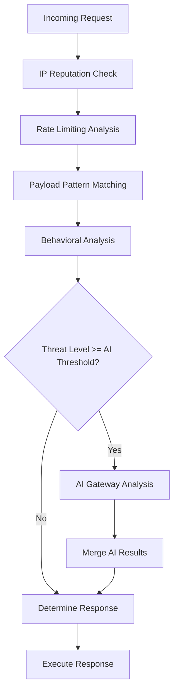

# Kong Guard AI - Technical Architecture

## Architecture Decisions and Rationale

This document details the technical architecture decisions made for Kong Guard AI, following Kong Gateway 3.x+ best practices and performance requirements.

## Core Design Principles

### 1. Performance First (<10ms Latency Requirement)
- **Compiled Regex Patterns**: All threat detection patterns are pre-compiled during `init_worker` phase
- **Shared Memory Usage**: Leverages `ngx.shared.DICT` for cross-worker state without blocking
- **Async Operations**: All external calls (notifications, AI Gateway) use `ngx.timer.at` for non-blocking execution
- **Smart Caching**: AI analysis results cached for 5 minutes to avoid duplicate expensive operations
- **Early Exit Patterns**: Dry run mode and whitelist checks exit early to minimize processing

### 2. Kong Plugin Lifecycle Compliance
The plugin strictly follows Kong's plugin development guidelines:

```lua
-- Required plugin metadata
VERSION = "0.1.0"
PRIORITY = 1000  -- High priority for security plugins

-- Lifecycle phases implemented
init_worker()    -- One-time setup per worker
access()         -- Real-time threat detection
header_filter()  -- Response analysis
response()       -- Learning and adaptation
log()           -- Incident logging and cleanup
```

### 3. Modular Architecture
Each component has a single responsibility:

- **`handler.lua`**: Plugin lifecycle orchestration
- **`detector.lua`**: Threat detection algorithms
- **`responder.lua`**: Automated response execution
- **`notifier.lua`**: Multi-channel notifications
- **`ai_gateway.lua`**: AI-powered analysis integration

## Threat Detection Engine Design

### Multi-Layer Detection Strategy



### 1. IP Reputation Analysis
- **Whitelist Override**: Immediate bypass for trusted IPs
- **Blacklist Blocking**: Instant rejection for known threats
- **Repeat Offender Tracking**: In-memory violation history with TTL
- **CIDR Block Support**: Planned for production implementation

### 2. Rate Limiting Detection
- **Sliding Window**: Configurable time windows (default: 60 seconds)
- **Dynamic Thresholds**: Threat level based on multiples of base limit
- **Per-IP Tracking**: Separate rate tracking per client IP
- **Memory-Efficient Cleanup**: Periodic removal of expired entries

### 3. Payload Analysis
- **Compiled Patterns**: Pre-compiled regex for performance
- **Size Limits**: Configurable max payload size for analysis
- **Context Preservation**: Stores pattern match context for investigation
- **Threat Type Classification**: Maps patterns to specific attack types

### 4. Behavioral Analysis
- **User Agent Analysis**: Bot detection and suspicious client identification
- **HTTP Method Validation**: Unusual method detection
- **Path Traversal Detection**: Directory traversal attempt identification
- **Header Anomaly Detection**: Missing or malformed header analysis

## Response System Architecture

### Graduated Response Model

```lua
-- Response escalation based on threat level
if threat_level >= 9 then
    return "block"          -- CRITICAL: Immediate blocking
elseif threat_level >= 7 then
    return "rate_limit"     -- HIGH: Dynamic rate limiting
elseif threat_level >= 5 then
    return "monitor"        -- MEDIUM: Enhanced monitoring
else
    return "allow"          -- LOW: Normal processing
end
```

### 1. Blocking Response
- **Immediate Rejection**: Uses `kong.response.exit()` for instant blocking
- **Custom Error Messages**: Threat-specific error responses
- **IP Blocklist Management**: Temporary blocking with TTL
- **Audit Trail**: Complete incident logging

### 2. Rate Limiting Response
- **Dynamic Limits**: Calculated based on threat level
- **Kong Admin API Integration**: Uses Kong's native rate limiting
- **Service-Specific**: Can apply limits per Kong service/route
- **Graceful Degradation**: Fallback to monitoring if API unavailable

### 3. Configuration Rollback
- **Admin API Integration**: Uses Kong's configuration management
- **Backup Configuration**: Maintains previous config snapshots
- **Critical Threat Response**: Only for threat level >= 9
- **Safety Checks**: Validates rollback success

## AI Gateway Integration Design

### AI-Powered Threat Analysis

```lua
-- AI analysis flow
local ai_prompt = build_threat_analysis_prompt(request_context, threat_result)
local ai_response = call_ai_gateway(ai_prompt, conf)
local ai_result = parse_ai_response(ai_response)
return merge_ai_results(original_threat, ai_result)
```

### 1. Structured Prompts
- **Threat Detection Prompt**: Comprehensive request analysis
- **Behavioral Analysis**: Pattern recognition for automation
- **Payload Analysis**: Deep content inspection
- **JSON Response Format**: Structured AI output for parsing

### 2. Caching Strategy
- **5-Minute Cache**: Avoid duplicate expensive AI calls
- **Request Fingerprinting**: Cache key based on request characteristics
- **Memory Management**: Automatic cache cleanup with TTL

### 3. Fallback Handling
- **Timeout Management**: 5-second default timeout
- **Error Handling**: Graceful degradation on AI failure
- **Text Parsing**: Fallback extraction from unstructured responses

## Notification System Design

### Multi-Channel Architecture

```lua
-- Async notification delivery
ngx.timer.at(0, function(premature)
    send_slack_notification(notification, conf)
    send_email_notification(notification, conf) 
    send_webhook_notifications(notification, conf)
end)
```

### 1. Non-Blocking Delivery
- **Timer-Based**: Uses `ngx.timer.at` for async execution
- **Independent Channels**: Failure in one doesn't affect others
- **Rate Limiting**: Built-in notification rate limiting
- **Retry Logic**: Planned for production implementation

### 2. Rich Formatting
- **Slack Integration**: Rich attachments with color coding
- **Email Templates**: HTML and plain text support
- **Webhook Payload**: Structured JSON for integration
- **Incident Context**: Complete threat and response details

## Performance Optimizations

### 1. Memory Management
- **Shared Memory**: Uses `ngx.shared.DICT` for cross-worker data
- **TTL-Based Cleanup**: Automatic expiration of cached data
- **Size Limits**: Bounded cache sizes to prevent memory leaks
- **Periodic Cleanup**: Random cleanup triggers (0.1% chance per request)

### 2. Processing Efficiency
- **Early Exit**: Whitelist and dry-run mode bypass heavy processing
- **Pattern Compilation**: One-time regex compilation in `init_worker`
- **Smart Sampling**: Learning data collection with configurable rates
- **Lazy Loading**: AI analysis only when threshold exceeded

### 3. Network Optimization
- **Connection Pooling**: HTTP client reuse for external calls
- **Timeout Management**: Aggressive timeouts to prevent blocking
- **SSL Verification**: Disabled for internal services (configurable)
- **Compression**: JSON payload compression for large data

## Security Considerations

### 1. Information Disclosure Prevention
- **Error Response Sanitization**: Removes sensitive server information
- **Log Sanitization**: Prevents credential leakage in logs
- **Rate Limiting**: Prevents information gathering attacks
- **Admin API Security**: Optional API key authentication

### 2. Memory Safety
- **Bounded Buffers**: Maximum sizes for all cached data
- **Input Validation**: Strict validation of all configuration
- **Pattern Safety**: Regex compilation error handling
- **Resource Limits**: CPU and memory usage monitoring

### 3. Configuration Security
- **Schema Validation**: Kong's built-in configuration validation
- **Sensitive Data Handling**: Proper handling of API keys and secrets
- **Default Security**: Secure defaults for all configuration options
- **Audit Logging**: Complete audit trail of all actions

## Deployment Considerations

### 1. Kong Gateway Compatibility
- **Version Support**: Kong Gateway 3.x+ (OSS and Enterprise)
- **Deployment Modes**: Hybrid, traditional, and DB-less
- **Plugin Priority**: High priority (1000) for early execution
- **Resource Requirements**: Minimal memory and CPU overhead

### 2. Scalability
- **Stateless Design**: No shared state between nodes
- **Horizontal Scaling**: Linear scalability with Kong nodes
- **Cache Distribution**: Per-node caching with optional clustering
- **Load Balancing**: Compatible with Kong's load balancing

### 3. Monitoring Integration
- **Kong Analytics**: Native integration with Kong's analytics
- **Prometheus Metrics**: Planned metrics export
- **Health Checks**: Built-in health check endpoints
- **Performance Monitoring**: Request processing time tracking

## Future Enhancements

### 1. Machine Learning Pipeline
- **Local ML Models**: On-node ML inference for low latency
- **Feature Engineering**: Advanced request feature extraction
- **Model Training**: Continuous learning from operator feedback
- **A/B Testing**: Model performance comparison

### 2. Advanced Integrations
- **Threat Intelligence**: External threat feed integration
- **SIEM Integration**: Security information event management
- **Compliance Reporting**: Automated compliance report generation
- **Multi-Tenant Support**: Tenant-specific configuration and policies

### 3. Performance Optimizations
- **JIT Compilation**: LuaJIT optimizations for hot paths
- **WASM Integration**: WebAssembly modules for complex algorithms
- **GPU Acceleration**: ML model inference acceleration
- **Edge Computing**: Distributed threat detection at edge nodes