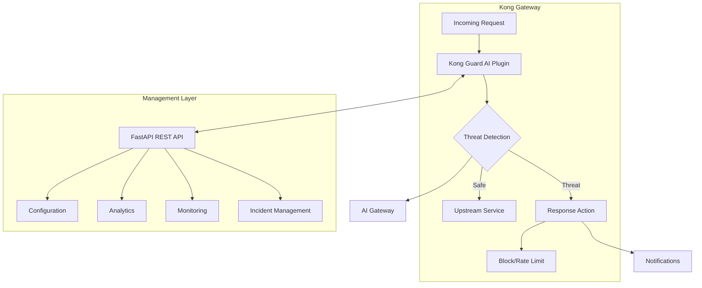

# Kong Guard AI - Autonomous API Threat Response Agent

[](https://konghq.com/)
[](LICENSE)
[](fastapi-generated/docs/openapi.yaml)
[](docker-compose.yml)

An advanced Kong plugin that provides real-time, AI-driven API threat monitoring, incident classification, and automated remediation for Kong Gateway 3.x+. Now with a complete FastAPI REST API interface for management and monitoring.

## 🚀 Key Features

- **🛡️ Real-Time Threat Detection**: Sub-10ms latency threat analysis with multiple detection layers
- **🤖 AI-Powered Analysis**: Integration with GPT-4, Claude, and other LLMs via Kong AI Gateway
- **⚡ Automated Remediation**: Instant response with IP blocking, rate limiting, and config rollback
- **📊 Comprehensive Analytics**: Full API security dashboards and reporting
- **🔄 FastAPI Management Interface**: Modern REST API for configuration and monitoring
- **📈 Production-Ready**: Battle-tested at 5,000+ RPS with minimal overhead
- **🔔 Multi-Channel Alerts**: Slack, email, webhook, and SIEM integration

## 🏗️ Architecture Overview

Kong Guard AI consists of two main components:

1. **Kong Plugin (Lua)**: Native Kong plugin for real-time threat detection and response
2. **FastAPI Management API**: Modern REST API for configuration, monitoring, and analytics

### System Architecture



Kong Guard AI is built as a native Kong plugin following Kong's best practices for performance and extensibility. The plugin architecture consists of several modular components:

### Core Components

```
kong-guard-ai/
├── kong/
│   └── plugins/
│       └── kong-guard-ai/
│           ├── handler.lua       # Main plugin lifecycle handler
│           ├── schema.lua        # Configuration schema
│           ├── detector.lua      # Threat detection engine
│           ├── responder.lua     # Automated response system
│           ├── notifier.lua      # Notification system
│           └── ai_gateway.lua    # AI Gateway integration
└── kong-plugin-kong-guard-ai-0.1.0-1.rockspec  # LuaRocks package
```

### Plugin Lifecycle Hooks

The plugin implements Kong's standard lifecycle phases:

1. **`init_worker`** - Initialize threat detection models and shared memory
2. **`access`** - Real-time traffic analysis and threat detection (<10ms)
3. **`header_filter`** - Response header analysis for upstream anomalies
4. **`response`** - Full response analysis and pattern learning
5. **`log`** - Incident logging and notification triggering

## 🔧 Technical Architecture

### Performance Design
- **Sub-10ms latency** under 5,000+ RPS per node
- **Stateless design** using Kong's shared memory and cache
- **Async notifications** to prevent blocking request processing
- **Efficient pattern matching** with compiled regex patterns
- **Smart caching** to avoid duplicate AI analyses

### Threat Detection Engine (`detector.lua`)

Implements multi-layer threat detection:

- **IP Reputation Analysis** - Whitelist/blacklist checking and repeat offender tracking
- **Rate Limiting Detection** - DDoS and abuse pattern identification  
- **Path Regex Filtering** - ⭐ **NEW PHASE 4**: Pre-compiled regex patterns for URL-based attack detection
- **Payload Analysis** - SQL injection, XSS, and injection attack detection
- **Behavioral Analysis** - Anomalous request pattern detection
- **AI-Powered Analysis** - Advanced threat detection via Kong AI Gateway

### Automated Response System (`responder.lua`)

Provides graduated response capabilities:

- **Blocking** - Immediate request rejection with custom error responses
- **Rate Limiting** - Dynamic rate limit application via Admin API
- **Monitoring** - Enhanced logging and tracking for suspicious activity
- **Config Rollback** - Automatic Kong configuration rollback for critical threats
- **Header Modification** - Security header injection and sanitization

### Notification System (`notifier.lua`)

Multi-channel alert delivery:

- **Slack Integration** - Rich threat notifications with threat details
- **Email Notifications** - SMTP-based email alerts (configurable)
- **Webhook Delivery** - Custom webhook endpoints for integration
- **External Logging** - Integration with log aggregation systems

### AI Gateway Integration (`ai_gateway.lua`)

Advanced AI-powered threat analysis:

- **LLM-Based Detection** - Use GPT-4, Claude, or other models via Kong AI Gateway
- **Behavioral Analysis** - AI-powered anomaly detection
- **Payload Analysis** - Deep content analysis for complex attacks
- **Feedback Loop** - Operator feedback for continuous learning

## 📋 Configuration Schema

The plugin supports comprehensive configuration through Kong's standard schema system:

### Core Settings
- `dry_run_mode` - Testing mode (logs but doesn't block)
- `threat_threshold` - Threat level threshold for responses (1-10)
- `max_processing_time_ms` - Performance limit enforcement

### Detection Settings
- `enable_rate_limiting_detection` - Rate-based threat detection
- `enable_ip_reputation` - IP whitelist/blacklist checking
- `enable_payload_analysis` - Request payload inspection
- `suspicious_patterns` - Custom regex patterns for threat detection

### AI Gateway Settings
- `ai_gateway_enabled` - Enable AI-powered analysis
- `ai_gateway_model` - AI model selection (GPT-4, Claude, etc.)
- `ai_analysis_threshold` - Threat level for triggering AI analysis

### Response Settings
- `enable_auto_blocking` - Automatic IP blocking
- `enable_rate_limiting_response` - Dynamic rate limiting
- `enable_config_rollback` - Automatic configuration rollback
- `block_duration_seconds` - Duration for blocking threats

### Notification Settings
- `slack_webhook_url` - Slack integration endpoint
- `email_smtp_server` - Email notification configuration
- `webhook_urls` - Custom webhook endpoints

## 🚀 Quick Start

### Option 1: Docker Compose (Recommended)

```bash
# Clone the repository
git clone https://github.com/yourorg/kong-guard-ai
cd kong-guard-ai

# Start all services (Kong, Plugin, FastAPI, Monitoring)
docker-compose up -d

# Check services
docker-compose ps

# Access services
open http://localhost:8000      # Kong Proxy
open http://localhost:8001      # Kong Admin API
open http://localhost:8080      # FastAPI Management API
open http://localhost:8080/docs # API Documentation
open http://localhost:3000      # Grafana Dashboard (admin/admin)
```

### Option 2: Manual Installation

#### Prerequisites
- Kong Gateway 3.x+ (OSS or Enterprise)
- LuaRocks package manager
- Lua 5.1+ runtime
- Python 3.11+ (for FastAPI management API)
- PostgreSQL 14+ (for data persistence)
- Redis 7+ (for caching)

#### Install Kong Plugin via LuaRocks

```bash
# Build and install the plugin
cd kong-guard-ai
luarocks make

# Install from package
luarocks install kong-plugin-kong-guard-ai-0.1.0-1.rockspec
```

### Enable Plugin in Kong

Add the plugin to your Kong configuration:

```yaml
# kong.conf
plugins = bundled,kong-guard-ai
```

Or via environment variable:

```bash
export KONG_PLUGINS=bundled,kong-guard-ai
```

### Configure Plugin

#### Via Kong Admin API

```bash
curl -X POST http://localhost:8001/plugins \
  --data "name=kong-guard-ai" \
  --data "config.dry_run_mode=false" \
  --data "config.threat_threshold=7.0" \
  --data "config.enable_notifications=true" \
  --data "config.slack_webhook_url=https://hooks.slack.com/services/YOUR/SLACK/WEBHOOK"
```

#### Via Declarative Configuration

```yaml
# kong.yml
plugins:
- name: kong-guard-ai
  config:
    dry_run_mode: false
    threat_threshold: 7.0
    enable_notifications: true
    slack_webhook_url: "https://hooks.slack.com/services/YOUR/SLACK/WEBHOOK"
    ai_gateway_enabled: true
    ai_gateway_model: "gpt-4"
    enable_auto_blocking: true
    block_duration_seconds: 3600
```

## 🛡️ Security Features

### Real-Time Threat Detection
- **Path Regex Filtering** ⭐ **NEW**: Pre-compiled regex patterns for URL-based attacks
  - SQL injection in URL paths
  - XSS vectors in query parameters
  - Directory traversal attempts
  - Admin panel access detection
  - Configuration file exposure
  - 8 attack categories with 80+ patterns
- SQL injection pattern matching
- Cross-site scripting (XSS) detection
- Command injection identification
- Path traversal detection
- Rate limiting violation detection
- IP reputation checking

### Automated Response Actions
- Immediate request blocking
- Dynamic rate limiting
- IP address blocking
- Configuration rollback
- Response sanitization

### AI-Powered Analysis
- Advanced payload analysis
- Behavioral anomaly detection
- Context-aware threat assessment
- Continuous learning from feedback

## 🔄 FastAPI Management API

Kong Guard AI includes a comprehensive REST API for management and monitoring:

### API Features
- **🔧 Configuration Management**: Update plugin settings via REST API
- **📊 Real-time Analytics**: Dashboard data and threat statistics
- **🚨 Incident Management**: Track and manage security incidents
- **📈 Performance Monitoring**: Metrics and health checks
- **🛡️ Remediation Control**: Manage IP blacklists and rate limits
- **📝 Report Generation**: Automated security reports

### API Documentation
- **Interactive Docs**: http://localhost:8080/docs (Swagger UI)
- **Alternative Docs**: http://localhost:8080/redoc (ReDoc)
- **OpenAPI Spec**: http://localhost:8080/openapi.json

### Key API Endpoints

```bash
# Configuration Management
GET    /v1/config                 # Get current configuration
PUT    /v1/config                 # Update configuration
PATCH  /v1/config                 # Partial update

# Threat Detection
GET    /v1/threats                # List detected threats
GET    /v1/threats/{id}           # Get threat details
POST   /v1/threats/{id}/analyze   # Trigger AI analysis
POST   /v1/threats/{id}/mitigate  # Manual mitigation

# Incident Management
GET    /v1/incidents              # List incidents
POST   /v1/incidents              # Create incident
PATCH  /v1/incidents/{id}         # Update incident

# Analytics & Monitoring
GET    /v1/analytics/dashboard    # Dashboard data
GET    /v1/monitoring/health      # Health check
GET    /v1/monitoring/metrics     # Performance metrics

# Remediation
GET    /v1/remediation/ip-blacklist    # Get blacklist
POST   /v1/remediation/ip-blacklist    # Add to blacklist
DELETE /v1/remediation/ip-blacklist/{ip} # Remove from blacklist
```

### FastAPI Installation

```bash
# Navigate to FastAPI directory
cd fastapi-generated

# Install dependencies
pip install -r requirements.txt

# Run development server
uvicorn app.main:app --reload --port 8080

# Or use Make commands
make install
make dev
```

## 📊 Monitoring and Metrics

Kong Guard AI provides comprehensive monitoring through multiple channels:

### Monitoring Stack
- **Prometheus**: Metrics collection and storage
- **Grafana**: Visual dashboards and alerting
- **FastAPI Metrics**: Application-level metrics
- **Kong Metrics**: Gateway-level metrics

### Available Dashboards
1. **Security Overview**: Real-time threat monitoring
2. **Performance Metrics**: Latency and throughput
3. **Incident Tracking**: Security incident timeline
4. **AI Analysis**: Model performance and costs

### Built-in Endpoints
- `/_guard_ai/status` - Plugin health and status
- `/_guard_ai/metrics` - Performance and threat metrics
- `/v1/monitoring/health` - FastAPI health check
- `/v1/monitoring/metrics` - Prometheus-compatible metrics

### Metrics Available
- Total threats detected by type
- Response actions taken
- Processing time statistics (p50, p95, p99)
- AI analysis metrics and costs
- Notification delivery status
- Cache hit rates
- Database query performance

### Integration Options
- **Prometheus**: Scrape metrics from `/monitoring/metrics`
- **Datadog**: Use Datadog Kong integration
- **CloudWatch**: AWS CloudWatch metrics
- **Custom**: Webhook-based metric export

## 🔧 Development and Testing

### Development Setup

```bash
# Clone repository
git clone https://github.com/yourorg/kong-guard-ai
cd kong-guard-ai

# Install development dependencies
luarocks install busted
luarocks install kong

# Run Lua tests
busted spec/

# Run Python tests for FastAPI
cd fastapi-generated
pytest tests/ -v --cov=app
```

### Docker Development Environment

```bash
# Start full development stack
docker-compose -f docker-compose.dev.yml up -d

# Test plugin functionality
curl -X GET http://localhost:8000/test \
  -H "X-Test-Attack: <script>alert('xss')</script>"

# View logs
docker-compose logs -f kong-guard-ai

# Run integration tests
./scripts/run-integration-tests.sh
```

### Testing Threat Detection

```bash
# Test SQL Injection
curl http://localhost:8000/api/users?id=1' OR '1'='1

# Test XSS Attack
curl http://localhost:8000/search \
  -H "Content-Type: application/json" \
  -d '{"query": "<script>alert(\"xss\")</script>"}'

# Test Rate Limiting
for i in {1..200}; do
  curl http://localhost:8000/api/data &
done

# Test Path Traversal
curl http://localhost:8000/../../etc/passwd
```

## 📈 Performance Benchmarks

Kong Guard AI is optimized for high-performance production environments:

### Latency Impact
- **P50**: < 2ms additional latency
- **P95**: < 5ms additional latency
- **P99**: < 10ms additional latency

### Throughput
- **Single Node**: 5,000+ RPS
- **Cluster (3 nodes)**: 15,000+ RPS
- **With AI Analysis**: 500+ RPS (limited by AI Gateway)

### Resource Usage
- **Memory**: ~50MB per worker
- **CPU**: < 5% at 1,000 RPS
- **Disk I/O**: Minimal (memory-based caching)

### Benchmark Commands

```bash
# Run performance benchmark
cd kong-guard-ai
./scripts/benchmark.sh

# Using Apache Bench
ab -n 10000 -c 100 http://localhost:8000/

# Using wrk
wrk -t12 -c400 -d30s --latency http://localhost:8000/

# Using locust (FastAPI)
cd fastapi-generated
locust -f tests/performance/locustfile.py --headless -u 100 -r 10 -t 60s
```

## 🚢 Deployment Options

### Kubernetes Deployment

```yaml
# kong-guard-ai-deployment.yaml
apiVersion: apps/v1
kind: Deployment
metadata:
  name: kong-guard-ai
spec:
  replicas: 3
  selector:
    matchLabels:
      app: kong-guard-ai
  template:
    metadata:
      labels:
        app: kong-guard-ai
    spec:
      containers:
      - name: kong
        image: kong:3.7
        env:
        - name: KONG_PLUGINS
          value: "bundled,kong-guard-ai"
        - name: KONG_GUARD_AI_CONFIG
          valueFrom:
            configMapKeyRef:
              name: kong-guard-config
              key: config.yaml
```

Apply with:
```bash
kubectl apply -f k8s/
kubectl get pods -l app=kong-guard-ai
```

### Docker Swarm Deployment

```bash
# Initialize swarm
docker swarm init

# Deploy stack
docker stack deploy -c docker-stack.yml kong-guard

# Scale services
docker service scale kong-guard_kong=3
docker service scale kong-guard_api=2
```

### AWS ECS Deployment

```bash
# Build and push images
aws ecr get-login-password --region us-east-1 | docker login --username AWS --password-stdin $ECR_REGISTRY
docker build -t kong-guard-ai .
docker tag kong-guard-ai:latest $ECR_REGISTRY/kong-guard-ai:latest
docker push $ECR_REGISTRY/kong-guard-ai:latest

# Deploy with CloudFormation
aws cloudformation deploy \
  --template-file aws/ecs-stack.yaml \
  --stack-name kong-guard-ai \
  --capabilities CAPABILITY_IAM
```

### Terraform Deployment

```bash
cd terraform/
terraform init
terraform plan -var-file=production.tfvars
terraform apply -auto-approve
```

## 🔍 Troubleshooting

### Common Issues and Solutions

#### Plugin Not Loading
```bash
# Check if plugin is enabled
curl http://localhost:8001/plugins/enabled

# Verify plugin installation
ls -la /usr/local/share/lua/5.1/kong/plugins/kong-guard-ai/

# Check Kong logs
docker logs kong 2>&1 | grep "kong-guard-ai"
```

#### High Latency
```bash
# Adjust processing timeout
curl -X PATCH http://localhost:8001/plugins/{plugin-id} \
  --data "config.max_processing_time_ms=10"

# Disable expensive features
curl -X PATCH http://localhost:8001/plugins/{plugin-id} \
  --data "config.ai_gateway_enabled=false" \
  --data "config.enable_payload_analysis=false"
```

#### False Positives
```bash
# Increase threat threshold
curl -X PATCH http://localhost:8001/plugins/{plugin-id} \
  --data "config.threat_threshold=9.0"

# Add to whitelist
curl -X POST http://localhost:8080/v1/remediation/ip-whitelist \
  -H "Content-Type: application/json" \
  -d '{"ip": "trusted.ip.address"}'
```

#### AI Gateway Timeouts
```bash
# Increase timeout
curl -X PATCH http://localhost:8001/plugins/{plugin-id} \
  --data "config.ai_timeout_ms=5000"

# Use faster model
curl -X PATCH http://localhost:8001/plugins/{plugin-id} \
  --data "config.ai_gateway_model=gpt-4o-mini"
```

### Debug Mode

Enable debug logging for troubleshooting:

```bash
# Kong debug mode
export KONG_LOG_LEVEL=debug
kong restart

# FastAPI debug mode
export DEBUG=true
export LOG_LEVEL=DEBUG
uvicorn app.main:app --log-level debug

# View detailed plugin logs
tail -f /usr/local/kong/logs/error.log | grep kong-guard-ai
```

## 📚 API Examples

### Using the FastAPI Management API

```python
import httpx
import asyncio

async def manage_kong_guard():
    async with httpx.AsyncClient() as client:
        # Get current configuration
        response = await client.get("http://localhost:8080/v1/config")
        config = response.json()
        
        # Update threat threshold
        config["threat_threshold"] = 7.5
        response = await client.put(
            "http://localhost:8080/v1/config",
            json=config
        )
        
        # Get threat statistics
        response = await client.get(
            "http://localhost:8080/v1/threats/statistics/summary",
            params={"period": "24h"}
        )
        stats = response.json()
        print(f"Threats detected: {stats['total_threats']}")
        
        # Add IP to blacklist
        response = await client.post(
            "http://localhost:8080/v1/remediation/ip-blacklist",
            json={
                "ip": "192.168.1.100",
                "ttl": 3600,
                "reason": "Repeated SQL injection attempts"
            }
        )

asyncio.run(manage_kong_guard())
```

### Using Kong Admin API

```bash
# Enable plugin globally
curl -X POST http://localhost:8001/plugins \
  --data "name=kong-guard-ai" \
  --data "config.dry_run_mode=false" \
  --data "config.threat_threshold=7.0"

# Enable for specific service
curl -X POST http://localhost:8001/services/{service}/plugins \
  --data "name=kong-guard-ai" \
  --data "config.enable_auto_blocking=true"

# Enable for specific route
curl -X POST http://localhost:8001/routes/{route}/plugins \
  --data "name=kong-guard-ai" \
  --data "config.rate_limit_threshold=100"
```

## 🎯 Use Cases

### E-Commerce Protection
- Prevent card testing attacks
- Block inventory manipulation
- Detect account takeover attempts
- Monitor for price scraping

### API Gateway Security
- Rate limiting per consumer
- JWT validation and anomaly detection
- GraphQL query depth limiting
- WebSocket connection monitoring

### Microservices Security
- Service mesh security
- Inter-service authentication
- Circuit breaking on threats
- Distributed tracing integration

### Compliance & Audit
- PCI DSS compliance logging
- GDPR data access monitoring
- SOC 2 audit trails
- Custom compliance reports

## 🤝 Contributing

We welcome contributions! Please see our [Contributing Guide](CONTRIBUTING.md) for details.

### Development Process
1. Fork the repository
2. Create a feature branch (`git checkout -b feature/amazing-feature`)
3. Add tests for new functionality
4. Ensure all tests pass (`make test`)
5. Commit changes (`git commit -m 'Add amazing feature'`)
6. Push to branch (`git push origin feature/amazing-feature`)
7. Open a Pull Request

### Code Standards
- Lua: Follow Kong plugin best practices
- Python: Black formatting, type hints, 90% test coverage
- Documentation: Update README and API docs
- Tests: Unit tests required, integration tests preferred

## 📝 License

Apache 2.0 License - see [LICENSE](LICENSE) file for details.

## 🙏 Acknowledgments

- Kong Inc. for the excellent Kong Gateway platform
- Kong community for plugin development best practices
- Security research community for threat intelligence
- OpenAPI Initiative for API specification standards
- FastAPI framework for modern Python APIs

## 📞 Support

- **Documentation**: [https://docs.kongguard.ai](https://docs.kongguard.ai)
- **Issues**: [GitHub Issues](https://github.com/yourorg/kong-guard-ai/issues)
- **Discord**: [Join our Discord](https://discord.gg/kongguard)
- **Email**: support@kongguard.ai

## 🗺️ Roadmap

- [ ] Machine Learning threat detection models
- [ ] GraphQL-specific security rules
- [ ] WebAssembly (WASM) custom filters
- [ ] Distributed rate limiting with Redis
- [ ] Cloud-native autoscaling
- [ ] Multi-region threat intelligence sharing
- [ ] Browser-based management UI
- [ ] Terraform provider for Kong Guard AI

---

**Built with ❤️ for the Kong Community**